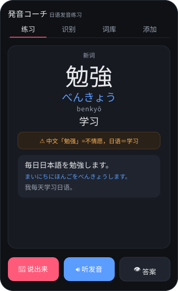
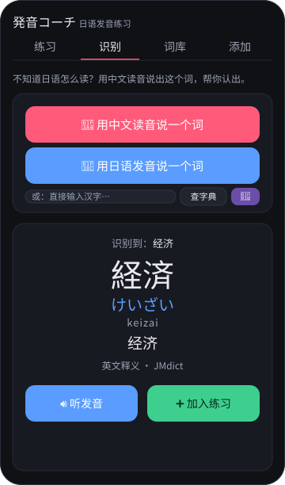
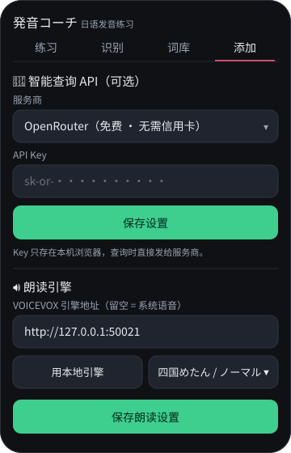

# 発音コーチ · 日语发音练习

A tiny, no-backend web app to stop reading Japanese kanji with Chinese pronunciation.

- **练习 (Practice):** see the kanji → say it out loud → the browser listens and scores how
  close your pronunciation was → reveals reading (kana + romaji), Chinese meaning, and an
  example sentence. Tap 🔊 to hear the correct pronunciation. Weak words come back sooner
  (lightweight SM-2 spaced repetition).
- **识别 (Identify):** the reverse direction — when you *don't* know the Japanese reading,
  either tap 🎤 and **say** the word using its **Chinese** pronunciation (recognition runs in
  `zh-CN`), or **type** the kanji directly (Chinese or Japanese) in the input box. The app
  captures the word, looks it up, shows the correct Japanese reading + meaning, and auto-plays
  the audio. Tap **加入练习** to drop it into your practice library.
- **词库 (Library):** browse / search every phrase, replay audio, see your stats.
- **添加 (Add):** add a phrase by hand (only the kanji is required).

## Screenshots

<table>
  <tr>
    <td></td>
    <td></td>
    <td></td>
  </tr>
  <tr>
    <td align="center"><sub>练习 Practice</sub></td>
    <td align="center"><sub>识别 Identify</sub></td>
    <td align="center"><sub>添加 / 设置 Settings</sub></td>
  </tr>
</table>

### Identify lookup layers
1. **Your library** + **`dict.js`** — ~115 curated common words with **Chinese** meanings and
   false-friend (trap) warnings.
2. **JMdict** (`jmdict.json.gz`, ~200k entries) — lazy-loaded fallback giving the correct
   reading + **English** gloss for essentially any word. Loaded once per session (gzipped
   ~8.7 MB, decompressed in the browser via `DecompressionStream`).
3. **AI (optional)** — tap **🤖 Claude** (or 🤖 用 Claude 查询 when a word isn't found) to ask
   an AI for any word, with a Chinese meaning + example sentence. In the **添加** tab pick a
   provider and paste a key:
   - **OpenRouter** (default, recommended) — **no credit card**; key from
     [openrouter.ai/keys](https://openrouter.ai/keys). Models tagged `:free` (DeepSeek, Qwen,
     Gemini-exp, Llama) are free with rate limits. Calls `openrouter.ai/api/v1/chat/completions`.
   - **DeepSeek** — official API; key from
     [platform.deepseek.com/api_keys](https://platform.deepseek.com/api_keys). Cheap, strong at
     CJK. Calls `api.deepseek.com/chat/completions` (OpenAI-compatible). Browser calls may be
     CORS-blocked — if so, a small proxy is needed.
   - **Google Gemini** — free AI-Studio tier; key from
     [aistudio.google.com/apikey](https://aistudio.google.com/apikey) (the AI Studio path, *not*
     Google Cloud / Vertex, which asks for billing). Calls `generativelanguage.googleapis.com`.
   - **Anthropic Claude** — pay-as-you-go; key from console.anthropic.com. Calls
     `api.anthropic.com` with the `anthropic-dangerous-direct-browser-access` header.

   All request JSON output so replies parse reliably. Keys are stored only in your browser's
   `localStorage` (per provider) and sent directly to that provider.

The lookup bridges the simplified-Chinese → Japanese-kanji gap (say 学习 → finds 学習): the
curated layer uses per-entry keys plus a learned character map, and the JMdict layer is
pre-indexed under simplified-Chinese aliases (composed from OpenCC character tables). Every
recognition alternative is tried to dodge Mandarin homophones.

## Dictionary data (JMdict)
`jmdict.json.gz` is generated from [yomidevs/jmdict-yomitan](https://github.com/yomidevs/jmdict-yomitan)
(JMdict, **CC BY-SA 4.0**), with simplified-Chinese aliases from
[OpenCC](https://github.com/BYVoid/OpenCC) (Apache-2.0). To regenerate:

```bash
cd tools/build
curl -LO https://github.com/yomidevs/jmdict-yomitan/releases/latest/download/JMdict_english.zip
curl -LO https://raw.githubusercontent.com/BYVoid/OpenCC/master/data/dictionary/JPShinjitaiCharacters.txt
curl -LO https://raw.githubusercontent.com/BYVoid/OpenCC/master/data/dictionary/TSCharacters.txt
python3 ../build_jmdict.py JMdict_english.zip JPShinjitaiCharacters.txt TSCharacters.txt ../../jmdict.json
gzip -9 -kf ../../jmdict.json   # produces jmdict.json.gz (shipped); raw jmdict.json is gitignored
```

## How content gets added
Tell Claude a phrase (you can use the Chinese reading). Claude replies with the Japanese
pronunciation and appends a full entry to `library.js`. Your practice scores live in
`localStorage` and are matched by `id`, so adding/editing the library never wipes progress.

## Run it locally
The mic / speech recognition need a *secure context*, so serve it over `localhost` — don't
just double-click the file.

```bash
git clone https://github.com/painterV/ACEJapaneseHatsuOnn.git
cd ACEJapaneseHatsuOnn
python3 serve.py 8123          # any Python 3; no dependencies
# open http://localhost:8123 in Chrome (best) or Safari
```

On the first 🎤 tap, allow microphone access. That's the whole app — Practice, Identify,
voice/typing lookup, and the JMdict dictionary all work with **no further setup**. The two
features below are optional upgrades; everything is stored in your browser, nothing is shared.

### Optional: AI smart-lookup (🤖)
For words even JMdict doesn't have, the **🤖** button can ask an AI for the reading + Chinese
meaning + example. You use **your own** key (kept only in your browser's `localStorage`):

1. Get a key — easiest free option is **OpenRouter** (no credit card):
   [openrouter.ai/keys](https://openrouter.ai/keys). (Other providers below.)
2. In the app: **添加** tab → **服务商** = your provider → paste the key → pick a **模型** →
   **保存设置**.
3. **识别** tab → type or say a word → tap **🤖**.

Providers (pick one in 添加):
- **OpenRouter** — free, no card. Free models load live; if one errors (rate-limit / busy),
  pick another or retry.
- **DeepSeek** — [platform.deepseek.com/api_keys](https://platform.deepseek.com/api_keys);
  cheap, strong CJK (needs a small top-up; browser calls may be CORS-limited).
- **Google Gemini** — free [AI Studio](https://aistudio.google.com/apikey) key (the *AI
  Studio* path, not Google Cloud, which asks for billing).
- **Anthropic Claude** — [console.anthropic.com](https://console.anthropic.com); pay-as-you-go.

### Optional: VOICEVOX TTS (best Japanese voice)
The 🔊 button uses your browser's voice (macOS **"Kyoko"**) by default. For much more natural
Japanese with correct **pitch accent**, run the free VOICEVOX engine locally:

1. Download & install **VOICEVOX** from [voicevox.hiroshiba.jp](https://voicevox.hiroshiba.jp/)
   and open the app — it runs the engine on `127.0.0.1:50021`.
   - On macOS you may see *"Apple could not verify VOICEVOX…"* — that's just Gatekeeper for an
     unnotarized open-source app. **System Settings → Privacy & Security → Open Anyway.**
2. In the app: **添加** tab → **🔊 朗读引擎** → click **用本地引擎 (127.0.0.1:50021)** → pick a
   **说话人** (speaker) and **语速** → **保存朗读设置**.
3. Now 🔊 uses VOICEVOX, and **automatically falls back to Kyoko** whenever the engine isn't
   running.

Notes: use `127.0.0.1`, not `localhost` (the engine binds IPv4 only). The engine URL field is
**empty by default** so it's safe to deploy publicly — leave it empty to just use Web Speech.
A side-by-side TTS comparison demo is at `tts-demo.html` (plus `tools/edge_proxy.py` for an
optional Edge-TTS voice).

## Deploying to GitHub Pages (public)
The app is fully static, so just serve the repo root over Pages (Settings → Pages → branch
`master`, root). It works under a project subpath (`/ACEJapaneseHatsuOnn/`) because all asset
paths are relative.

What's safe / what to know for a public deploy:
- **No secrets ship.** API keys live only in each visitor's browser `localStorage`; the
  `api_keys` file is git-ignored and never committed. Each visitor enters their **own** AI key
  (添加 tab). Never bake a key into the build.
- **VOICEVOX is off by default** — the engine URL setting is empty, so public visitors get
  **Web Speech (Kyoko)** and never ping `localhost`. Local users opt in via 添加 → 用本地引擎.
- **Mixed content:** an HTTPS Pages site generally can't reach a local `http://` VOICEVOX
  engine (browser Private-Network restrictions). VOICEVOX is best used when running the app
  locally (`serve.py`); for public-wide high-quality TTS, host an engine over HTTPS (or use a
  serverless TTS proxy) and put that URL in the setting.
- Optional: delete `tts-demo.html` / `tools/` before publishing if you want a lean deploy.

## Browser support
- **Speech recognition** (the 🎤 grading): Chrome / Edge / Safari. Needs internet.

## Files
- `index.html` — markup & tabs
- `styles.css` — styling
- `app.js` — practice queue, SM-2, speech recognition + TTS, identify/lookup, library, add form
- `library.js` — the practice phrase library (edit this to add words to drill)
- `dict.js` — curated lookup dictionary for the Identify tab (kanji → reading + Chinese)
- `jmdict.json.gz` — large JMdict fallback dictionary (generated; see above)
- `serve.py` — tiny static server for `localhost`
- `tools/build_jmdict.py` — converts the jmdict-yomitan release into `jmdict.json`
- `test/harness.js` — headless logic tests (run with macOS `jsc`, see below)

## Tests
```bash
/System/Library/Frameworks/JavaScriptCore.framework/Versions/A/Helpers/jsc test/harness.js
```
